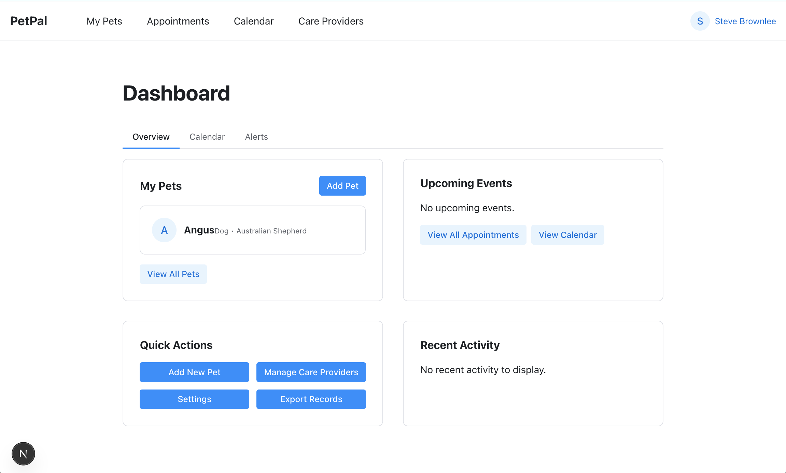

# PetPal - Pet Management System

PetPal is a comprehensive pet management application designed to help pet owners track and manage all aspects of their pets' health, care, and appointments.



## 🐾 Features

### User Authentication and Profiles
- **User Registration & Login**: Secure account creation and authentication
- **Profile Management**: Update personal information and preferences
- **Password Reset**: Self-service password recovery

### Pet Management
- **Add & Manage Pets**: Store comprehensive pet information
- **Pet Profiles**: Track species, breed, age, and other details
- **Photo Upload**: Add images to easily identify your pets

### Health Records
- **Vet Visit Tracking**: Record and manage veterinary appointments
- **Medication Management**: Track medications, dosages, and schedules
- **Vaccination Records**: Monitor immunization history and due dates
- **Weight & Growth Tracking**: Chart your pet's development over time

### Appointments
- **Schedule Management**: Create and manage vet appointments
- **Calendar Integration**: View all upcoming events in one place
- **Reminders**: Get alerts for upcoming appointments

### Feeding Schedule
- **Meal Planning**: Create and manage feeding routines
- **Portion Control**: Track food amounts and dietary needs

### Dashboard & Reporting
- **Centralized Dashboard**: Quick overview of all pet information
- **Upcoming Events**: See scheduled appointments and reminders
- **Export Functionality**: Download pet records for offline use or sharing

### Care Provider Management
- **Veterinarian Directory**: Store contact information for all your pet care providers
- **Provider Association**: Link providers to specific pet records

### Settings & Preferences
- **Notification Settings**: Configure how and when you receive alerts
- **Theme Preferences**: Customize the application's appearance

## Getting Started

### Prerequisites
- Node.js (v18 or higher)
- npm or yarn package manager

### Installation

1. Clone the repository
2. Install dependencies
    ```bash
    npm install
    ```
3. Start the development server
    ```bash
    npm run dev
    ```

4. Open [http://localhost:3000](http://localhost:3000) in your browser

### Backend Setup
The client application requires a backend API running at `http://localhost:5000`. See the backend repository for setup instructions.

## Key Components

### AuthContext
Provides authentication state and functions throughout the application:
- User information
- Login/logout functionality
- Role-based permission checks

### API Services
Modular service functions for API communication:
- `apiService.js`: Core HTTP request handling
- `petService.js`: Pet-related API endpoints
- `appointmentService.js`: Appointment management
- `healthRecordService.js`: Health record operations
- `authService.js`: Authentication endpoints

### Protected Routes
Components that restrict access to authenticated users only, redirecting unauthenticated users to the login page.

### Error Boundaries
Components that catch JavaScript errors and display fallback UI to prevent the entire application from crashing.

## License

This project is licensed under the MIT License - see the [LICENSE](./LICENSE.md) file for details.
